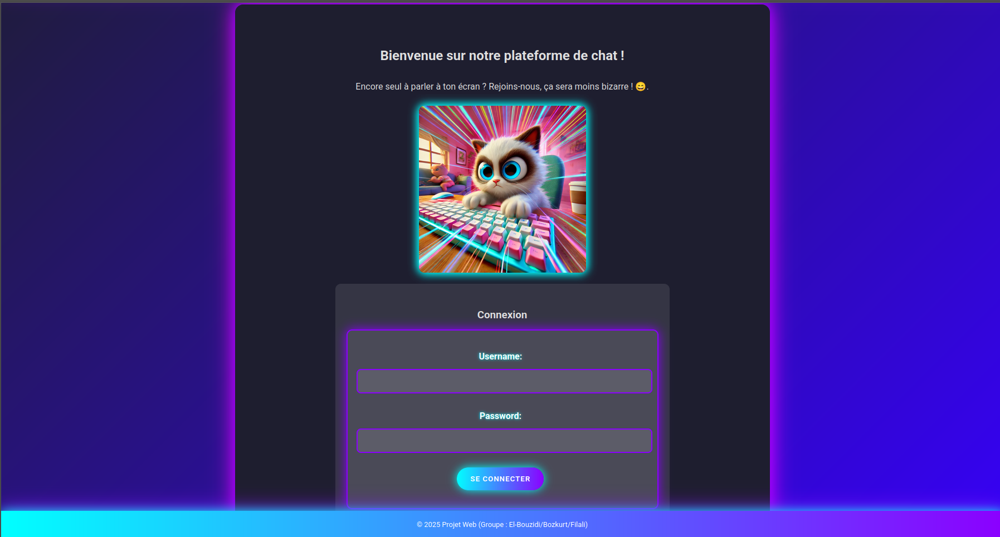
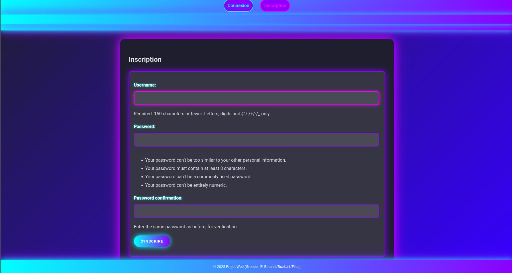
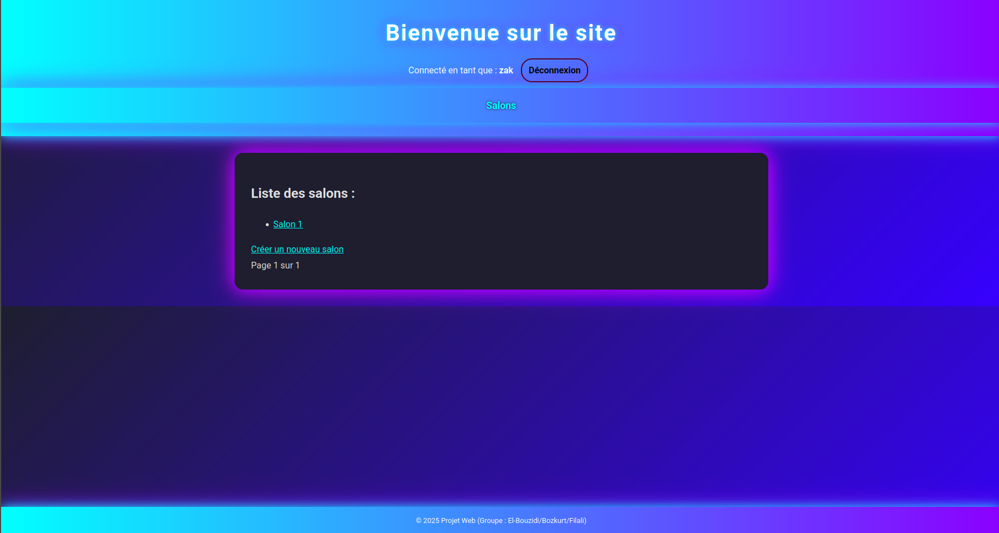
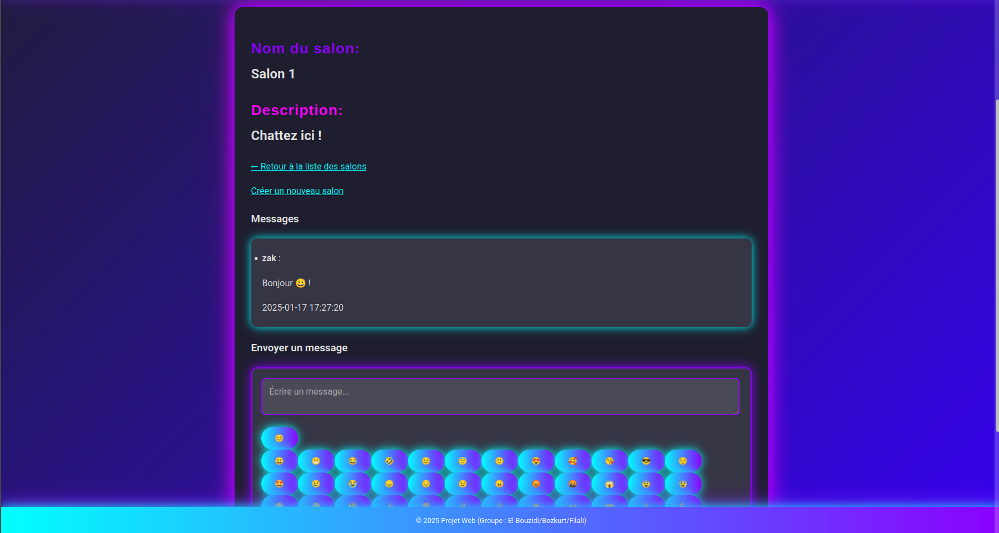
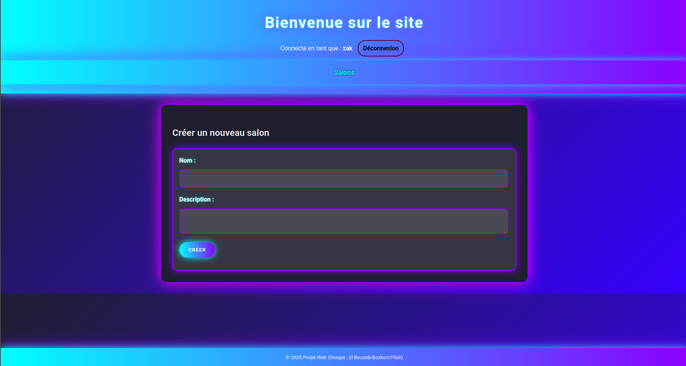

# Django Chat Application

A Django-based chat application that allows users to create discussion rooms and exchange messages with automatic updates.

⚠️ The projet is made in French, as required by the French academic system.

## Features

- Authentication system (registration/login)
- Discussion room creation (admin only)
- Automatic message updates via polling
- Emoji support
- Responsive interface
- Salon pagination system
- Role management (admin/member)

## Prerequisites

- Python 3.8+
- Django 5.0+

## Deployment

The application is now accessible at the following address:  
**[https://zakbzd.pythonanywhere.com](https://zakbzd.pythonanywhere.com)**

## Installation

1. Create a virtual environment and activate it:
```bash
python -m venv venv
source venv/bin/activate  # Linux/Mac
venv\Scripts\activate     # Windows
```

2. Install dependencies:
```bash
pip install django
```

3. Run migrations:
```bash
python manage.py makemigrations
python manage.py migrate
```

4. Create a superuser:
```bash
python manage.py createsuperuser
```

5. Launch the development server:
```bash
python manage.py runserver
```

## Project Structure

```
prog_web/
├── chat/                   #main application
│   ├── static/            #static files (CSS, JS)
│   │   └── css/          #CSS styles
│   ├── templates/         #HTML templates
│   ├── migrations/        #Database migrations
│   ├── models.py          #Data models
│   ├── views.py           #views
│   ├── urls.py           #URL configuration
│   └── forms.py          #Forms
└── prog_web/             #project configuration
    ├── settings.py       #project settings
    ├── urls.py          #main URLs
    └── wsgi.py          #WSGI configuration
```

## Screenshots

### Login Screen


### Sign In Screen


### Room List


### Room View


### Create Room


## Usage

1. Access `http://localhost:8000` in your browser
2. Create an account or log in
3. Browse existing rooms or create a new one
4. Access moderation via `http://localhost:8000/admin` (admins only)
5. Start chatting!

## Security

- CSRF protection enabled
- Authentication required for sensitive actions
- Server-side data validation
- Role-based permission management

## Technical Highlights

- **Real-time messaging** with intelligent polling
- **Modern UI/UX** with cyberpunk design and neon effects
- **Responsive design** for mobile and desktop
- **Emoji support** with integrated picker
- **Role-based access control**
- **Production deployment** on PythonAnywhere
- **Optimized performance** with pagination and efficient queries

## Technologies Used

- **Backend**: Django 5.1.4, SQLite, Django ORM
- **Frontend**: HTML5, CSS3, JavaScript ES6+, Fetch API
- **Security**: CSRF protection, authentication, validation
- **Deployment**: PythonAnywhere, WSGI

## License
- **This project is released under the MIT License.

